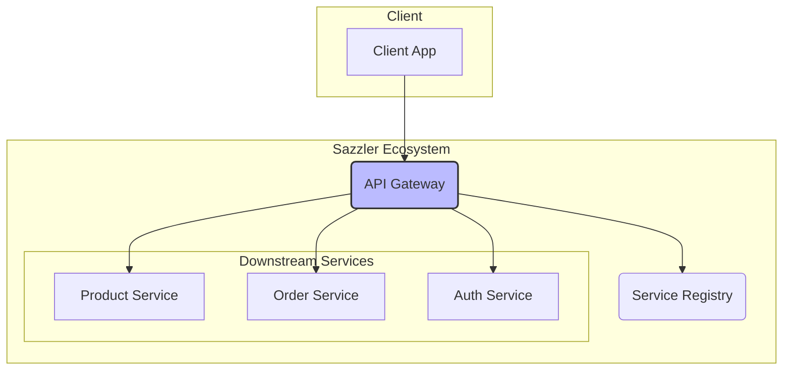

# Sazzler API Gateway

## 1. Overview
The **Sazzler API Gateway**, built with Spring Cloud Gateway, serves as the single entry point for all client requests into the Sazzler microservices ecosystem. It is responsible for routing requests to the appropriate downstream service, handling cross-cutting concerns like authentication and security, and providing a unified API to external clients.

By abstracting the underlying microservices, the API Gateway simplifies client-side development and enhances security.

## 2. Architecture

### 2.1. Request Flow
All incoming traffic from clients (web, mobile) first hits the API Gateway. The gateway then uses the **Service Registry** to discover the location of the target microservice and forwards the request.



### 2.2. Key Responsibilities
- **Routing:** Dynamically routes requests based on path predicates.
- **Authentication:** Validates JWT tokens before forwarding requests to protected services.
- **Load Balancing:** Integrates with Eureka to load balance requests across multiple instances of a service.
- **Rate Limiting & Resilience:** (Future) Can be configured with filters for rate limiting (Resilience4j) and circuit breaking.

## 3. Features
- **Dynamic Routing:** Routes are configured in `application.yaml` and can be refreshed dynamically.
- **Service Discovery Integration:** Looks up service locations from the Eureka Service Registry.
- **JWT Authentication Filter:** A custom global filter intercepts and validates JWTs.
- **Path Rewriting:** Modifies request paths to match the downstream service's API structure.
- **CORS Configuration:** Centralized management of Cross-Origin Resource Sharing.

## 4. Setup and Configuration

### 4.1. Prerequisites
- Java 21+
- Gradle 8.x+
- A running instance of the **Sazzler Service Registry**.

### 4.2. Build & Run
```bash
# Build the project
./gradlew build

# Run the application
./gradlew bootRun
```
The gateway starts on port `8080` by default.

### 4.3. Configuration (`application.yaml`)
This is a critical file that defines the routing rules.

```yaml
server:
  port: 8080

spring:
  application:
    name: sazzler-api-gateway
  cloud:
    gateway:
      discovery:
        locator:
          # Enable discovering services from Eureka
          enabled: true
          lower-case-service-id: true
      routes:
        # Route to Product Service
        - id: product-service-route
          # Use 'lb://' for load balancing via Eureka
          uri: lb://sazzler-product-service
          predicates:
            # Match requests to /api/product/**
            - Path=/api/product/**
          filters:
            # Rewrite the path before forwarding
            # e.g., /api/product/all -> /all
            - RewritePath=/api/product/(?<segment>.*), /$\{segment}

        # Route to Auth Service
        - id: auth-service-route
          uri: lb://sazzler-auth-service
          predicates:
            - Path=/auth/**

# Eureka client configuration
eureka:
  client:
    service-url:
      defaultZone: http://localhost:8761/eureka/

# JWT Secret for token validation
jwt:
  secret: your-super-secret-key
```

## 5. API Endpoints
The gateway exposes a unified API. Clients should target these endpoints, not the individual services.
- **Product Service:** `http://localhost:8080/api/product/*`
- **Auth Service:** `http://localhost:8080/auth/*`
- **Order Service:** `http://localhost:8080/api/order/*` (example)

## 6. Docker

### 6.1. Build Docker Image
```bash
docker build -t sazzler-api-gateway .
```

### 6.2. Run Docker Container
```bash
docker run -p 8080:8080 \
  -e EUREKA_CLIENT_SERVICEURL_DEFAULTZONE=http://eureka-host:8761/eureka/ \
  -e JWT_SECRET=your-super-secret-key \
  sazzler-api-gateway
```
*Replace `eureka-host` with the actual hostname or IP of your Eureka server if running in a different container.*

## 7. Troubleshooting
- **404 Not Found:**
    - Check if the `predicates` in your `application.yaml` match the request URL.
    - Ensure the target service (e.g., `sazzler-product-service`) is registered with Eureka.
- **503 Service Unavailable:**
    - Verify the `uri` (`lb://service-name`) matches the `spring.application.name` of the downstream service.
    - Ensure the downstream service is running and healthy.
- **Authentication Errors (401 Unauthorized):**
    - Make sure the JWT secret key in the API Gateway matches the one used by the Auth Service.
    - Check that the `Authorization` header with the Bearer token is being sent correctly.

